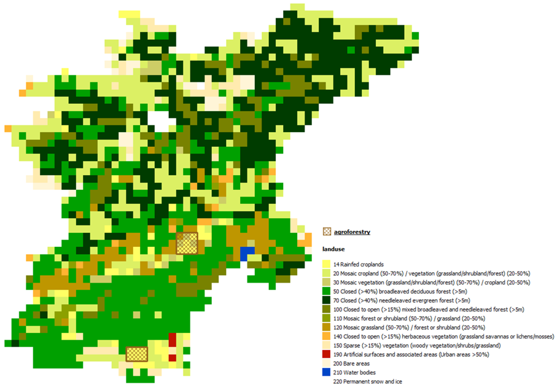

.. currentmodule:: hydromt_wflow

Setup Agroforestry
==================

Description
-----------
Agroforestry is a practice that integrates trees and shrubs into agricultural landscapes.
The ``setup_agroforestry`` method is part of a set of methods to add Nature Based Solutions
(NBS) to a Hydromt Wflow model. This method allows users to integrate agroforestry
areas into the land use configuration of the model. By specifying agroforestry regions,
users can modify land use characteristics to better represent the influence of agroforestry
practices on hydrological processes.

Users can provide agroforestry areas either through a raster file or a vector file.
For example, users can use global land cover datasets that include agroforestry classes,
convert all agricultural areas of their landuse to agroforestry areas, or use custom
shapefiles delineating agroforestry zones.

Agroforestry parameters and lookup table
----------------------------------------
Agroforestry is a NBS measure that modify the landuse and hence the landuse related
parameters in Wflow. Users have several options to define the related landuse parameters
for agroforestry. As for other ``setup_lulcmaps`` methods, users can provide a lookup table
or use the default lookup table provided with Hydromt Wflow:

.. csv-table::
  :file: ../../../hydromt_wflow/data/lulc/v1.0/agroforestry_mapping.csv
  :header-rows: 1

Or users can provide a complete landuse lookup table and define their own mix of landuse
classes and fractions to represent agroforestry areas, for example 90% cropland and 10% shrubs.
For example, the values in the default agroforestry lookup table above were derived
use the esa_worldcover_mapping_default lookup table with a mix of 75% cropland (class 40),
15% shrubs (class 20) and 10% trees (class 10).

Example usage
-------------
Here are two examples of how to use the ``setup_agroforestry`` method in a Hydromt Wflow model:

1. Using a vector file to define agroforestry areas and a mix of 90% cropland and 10% shrubs of the esa_worldcover_mapping_default lookup table.
2. Converting all agricultural areas in the catchment above (class 14 in globcover) to agroforestry areas and using the default agroforestry lookup table.

.. tab-set::

    .. tab-item:: Command Line Interface (CLI)

        The definition of the method and the arguments is done in a workflow file (YAML format).
        The workflow file can then be used to build or update a model from the command line interface.
        For example, using the pre-defined ``artifact_data`` catalog:

        .. code-block:: console

            $ hydromt update wflow_sbm "./path/to/model_to_update" -o "./path/to/model_with_agroforestry" -d "artifact_data" -i "./path/to/add_agroforestry.yaml" -v

        For our first example, the workflow YAML file (``add_agroforestry.yaml``) would look like this:

        .. code-block:: yaml

            steps:
              - setup_agroforestry:
                  agroforestry_fn: "agroforestry areas" # data catalog entry
                  output_agroforestry_class: 15 # new landuse class for agroforestry areas
                  lulc_mapping_fn: "esa_worldcover_mapping_default" # esa_worldcover lookup table
                  lulc_mix_classes: [40, 20] # cropland, shrubs classes in esa_worldcover
                  lulc_mix_fractions: [0.9, 0.1] # 90% cropland, 10% shrubs
                  output_names_suffix: "agroforestry" # suffix for the new staticmap names

        For our second example, the workflow YAML file (``add_agroforestry.yaml``) would look like this:

        .. code-block:: yaml

            steps:
              - setup_agroforestry:
                  agroforestry_fn: "globcover" # globcover landuse raster
                  agroforestry_class: 14 # globcover agricultural class
                  output_agroforestry_class: 15 # new landuse class for agroforestry areas
                  agroforestry_mapping_fn: "agroforestry_mapping_default" # default agroforestry lookup table

    .. tab-item:: Python API

        For python, you need to first instantiate a Wflow model and then call the setup methods directly:

        .. code-block:: python

            from hydromt_wflow import WflowSbmModel

            model = WflowSbmModel(
              root="path/to/model_to_update",
              mode="r+",
              data_libs=["artifact_data"]
            )

        For our first example, the python code would look like this:

        .. code-block:: python

            model.setup_agroforestry(
                agroforestry_fn="agroforestry areas", # data catalog entry
                output_agroforestry_class=15, # new landuse class for agroforestry areas
                lulc_mapping_fn="esa_worldcover_mapping_default", # esa_worldcover lookup table
                lulc_mix_classes=[40, 20], # cropland, shrubs classes in esa_worldcover
                lulc_mix_fractions=[0.9, 0.1], # 90% cropland, 10% shrubs
                output_names_suffix="agroforestry" # suffix for the new staticmap names
            )

        For our second example, the python code would look like this:

        .. code-block:: python

            model.setup_agroforestry(
                agroforestry_fn="globcover", # globcover landuse raster
                agroforestry_class=14, # globcover agricultural class
                output_agroforestry_class=15, # new landuse class for agroforestry areas
                agroforestry_mapping_fn="agroforestry_mapping_default" # default agroforestry lookup table
            )
