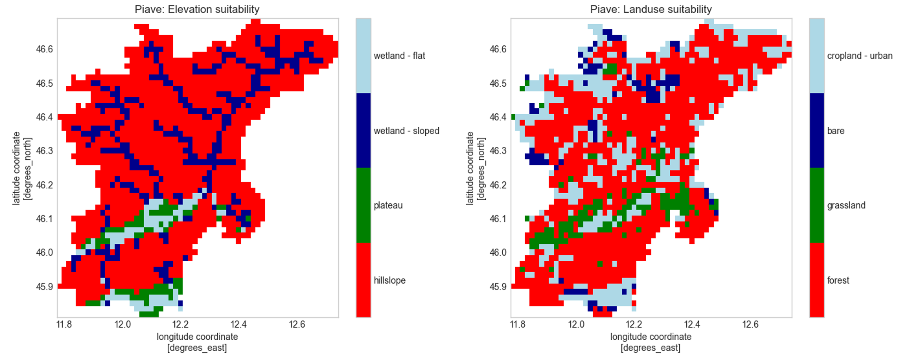

.. currentmodule:: hydromt_wflow

Setup Ponding
=============

Description
-----------
Many nature-based solutions (NBS) for water management share a common hydrological mechanism:
the **temporary storage (ponding) of water on the land surface**, followed by **enhanced infiltration
and groundwater recharge**. Although such measures differ in form and scale, their effect is to
slow overland flow, increase residence time, and promote re-infiltration into the soil.

To better represent these processes, new functionality has been added to the wflow model.
First, **re-infiltration of overland flow** is now allowed, enabling water that would previously
be routed laterally downstream to infiltrate back into the soil. Second, a **ponding threshold**
has been implemented: below a specified water depth, overland flow does not move laterally
but ponds on the land surface, increasing the potential for infiltration and recharge. When
this threshold is exceeded, excess water resumes lateral flow.

This ponding concept provides a flexible, process-based representation of a wide range of
NBS measures that involve surface water retention and infiltration, including:

- rainwater harvesting
- terracing
- small ponds in forested hillslope
- plastic-lined water harvesting ponds in cropland area
- hedgerows / stone lines / springshed revival through trenches and check dams in croplands areas
- soil bunds / demi-lunes

As a start, two methods have been implemented to set up ponding level in hydromt wflow:

- ``setup_ponding_from_map``: creates pond level based on a user specified ``pond_level``
  and a pond location map (raster or vector). The ponding level is applied to all grid cells
  where the ponding map indicates the presence of a pond (all non-nodata values for a raster
  or all features for a vector).
- ``setup_ponding_from_thresholds``: creates pond level based on a user specified ``pond_level``
  and a suitability map derived from landuse and/or hydrography criteria. The topographic
  criteria are based on the elevation, slope and hand maps, and the landuse criteria are
  based on the landuse map. For each criterion, a range of suitable values can be defined,
  and the final ponding suitability is determined by the intersection of all criteria.

In ``setup_ponding_from_thresholds``, the suitability map is derived by combining landuse
classes with elevation criteria. Elevation criteria including ranges in elevation, slope and
hand as used in `Gharari et al. (2011) <https://hess.copernicus.org/articles/15/3275/2011/hess-15-3275-2011.pdf>`_
which defines a hydrological landscape classification than can be useful for NBS:

- Wetland (flat): HAND < 5.9m & slope < 0.129
- Wetland (sloped): HAND < 5.9m & slope >= 0.129
- Plateau: HAND >= 5.9m & slope < 0.129
- Hillslope: HAND >= 5.9m & slope >= 0.129

Example usage
-------------

Setup ponding from map
^^^^^^^^^^^^^^^^^^^^^^
In this example, we will set up ponding in a Wflow model based on a user-defined ponding map
(vector file). We will specify a ponding level that determines the maximum depth at which
water will pond on the surface and a minimum depth of 0.001 m for the other cells (to avoid
computation issues with the local inertial routing equation).

.. tab-set::

    .. tab-item:: Command Line Interface (CLI)

        The definition of the method and the arguments is done in a workflow file (YAML format).
        The workflow file can then be used to build or update a model from the command line interface.
        Here our input files have a simple format so we can use file paths instead of data
        catalog entries:

        .. code-block:: console

            $ hydromt update wflow_sbm "./path/to/model_to_update" -o "./path/to/model_with_ponding" -i "./path/to/add_ponding.yaml" -v

        The workflow YAML file (``add_ponding.yaml``) would look like this:

        .. code-block:: yaml

            steps:
              - setup_ponding_from_map:
                  pond_fn: "./path/to/pond_locations.shp" # polygons with pond locations
                  pond_level: 0.1 # ponding level in m
                  min_pond_level: 0.001 # minimum ponding level for other cells in m
                  output_name: "ponding_level" # name of the output variable in the model staticmaps

    .. tab-item:: Python API

        For python, you need to first instantiate a Wflow model and then call the setup methods directly:

        .. code-block:: python

            from hydromt_wflow import WflowSbmModel

            # instantiate model
            model = WflowSbmModel(
                "./path/to/model_to_update",
                mode="r+",
            )

            # add static inflows at GRDC gauges
            model.setup_ponding_from_map(
                pond_fn="./path/to/pond_locations.shp", # polygons with pond locations
                pond_level=0.1, # ponding level in m
                min_pond_level=0.001, # minimum ponding level for other cells in m
                output_name="ponding_level", # name of the output variable in the model staticmaps
            )

Setup ponding from thresholds
^^^^^^^^^^^^^^^^^^^^^^^^^^^^^
In this example, we will set up ponding in a Wflow model based on user-defined suitability
criteria derived from landuse and hydrography maps. For example in the case of small ponds in forested hillslopes.

.. tab-set::

    .. tab-item:: Command Line Interface (CLI)

        The definition of the method and the arguments is done in a workflow file (YAML format).
        The workflow file can then be used to build or update a model from the command line interface.
        Here our input files have a simple format so we can use file paths instead of data
        catalog entries:

        .. code-block:: console

            $ hydromt update wflow_sbm "./path/to/model_to_update" -o "./path/to/model_with_ponding" -i "./path/to/add_ponding.yaml" -d artifact_data -v

        The workflow YAML file (``add_ponding.yaml``) would look like this:

        .. code-block:: yaml

            steps:
              - setup_ponding_from_thresholds:
                  lulc_fn: "vito_2015" # landuse map
                  hydrography_fn: "merit_hydro_ihu" # hydrography data
                  lulc_classes: [111, 112, 113, 114, 115, 116] # closed forest classes in vito_2015
                  elevtn_range: (0, 2000) # elevation range in m
                  slope_range: (0.129, 0.3) # slope range in m/m
                  hand_range: (5.9, 20) # hand range in m
                  pond_level: 0.02 # ponding level in m
                  min_pond_level: 0.0 # minimum ponding level for other cells in m
                  output_name: "ponding_level_forested_hillslope" # name of the output variable in the model staticmaps

    .. tab-item:: Python API

        For python, you need to first instantiate a Wflow model and then call the setup methods directly:

        .. code-block:: python

            from hydromt_wflow import WflowSbmModel

            # instantiate model
            model = WflowSbmModel(
                "./path/to/model_to_update",
                mode="r+",
                data_libs=["artifact_data"],
            )

            # add static inflows at GRDC gauges
            model.setup_ponding_from_thresholds(
                lulc_fn="vito_2015", # landuse map
                hydrography_fn="merit_hydro_ihu", # hydrography data
                lulc_classes=[111, 112, 113, 114, 115, 116], # closed forest classes in vito_2015
                elevtn_range=(0, 2000), # elevation range in m
                slope_range=(0.129, 0.3), # slope range in m/m
                hand_range=(5.9, 20), # hand range in m
                pond_level=0.02, # ponding level in m
                min_pond_level=0.0, # minimum ponding level for other cells in m
                output_name="ponding_level_forested_hillslope", # name of the output variable in the model staticmaps
            )
